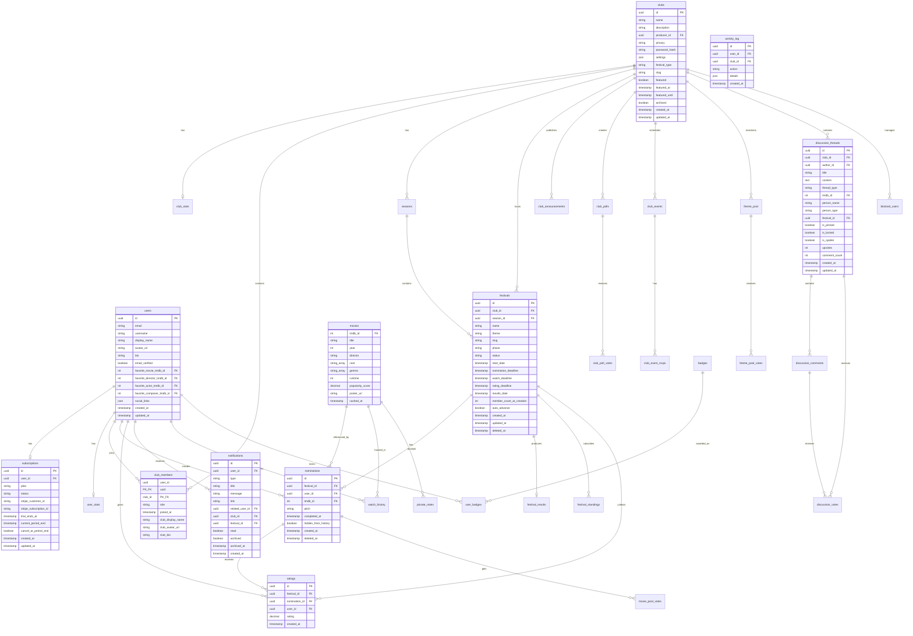
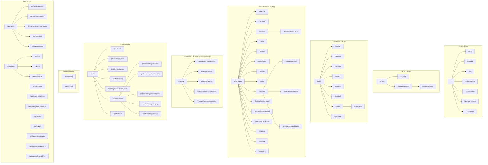
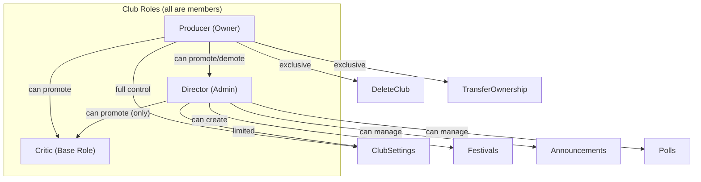
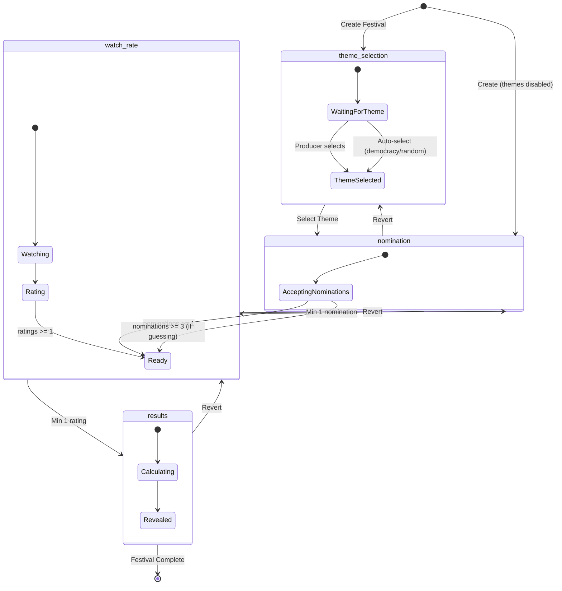
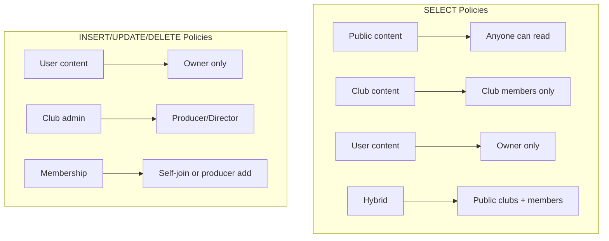
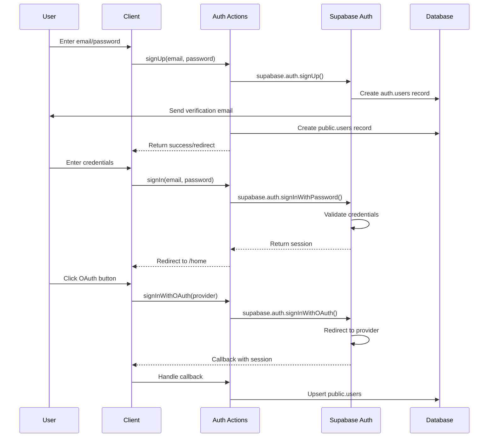
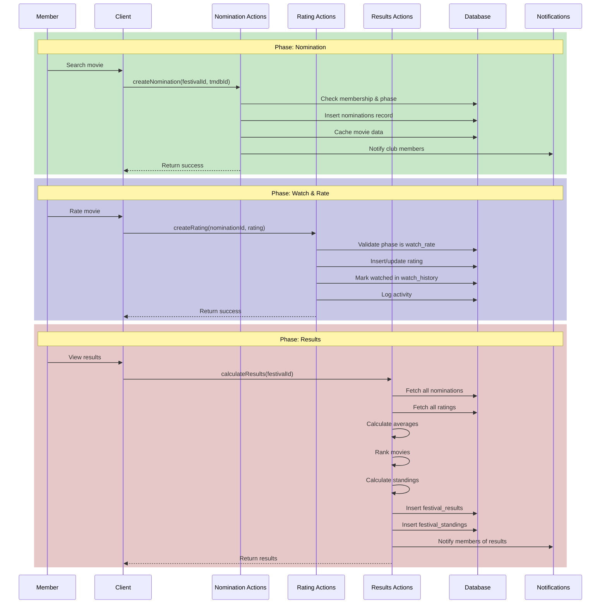
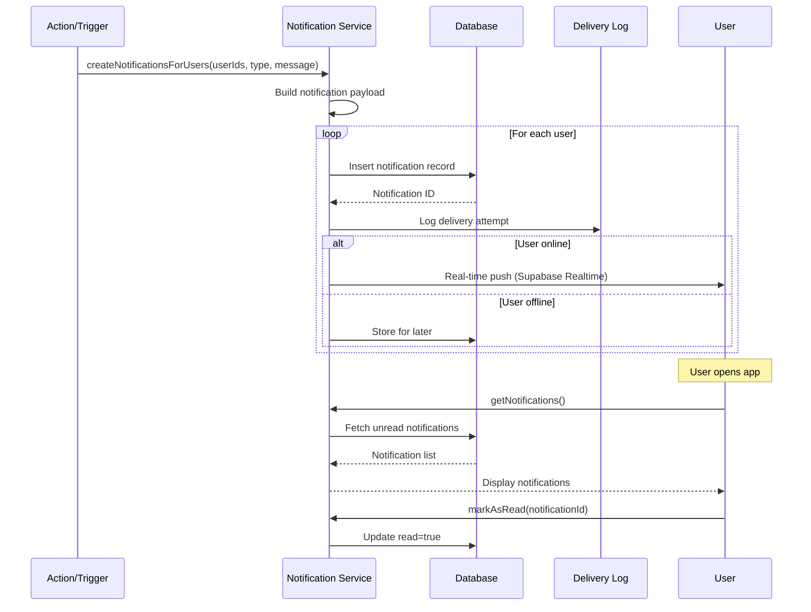

# Backrow Architecture Documentation

> Generated from codebase analysis on 2025-12-11, updated 2026-04-09

> NOTE: This is a point-in-time snapshot. For current schema, see Supabase
> tables (or generate types via `supabase gen types typescript`); for current
> routes, see [docs/backrow-site-map.md](docs/backrow-site-map.md). Sections
> below may have drifted from the live codebase.

## Table of Contents

1. [Database Schema](#1-database-schema)
2. [Route Map](#2-route-map)
3. [User/Club/Membership Model](#3-userclubmembership-model)
4. [Festival State Machine](#4-festival-state-machine)
5. [Server Actions Inventory](#5-server-actions-inventory)
6. [RLS Policies Summary](#6-rls-policies-summary)
7. [Key Flows](#7-key-flows)
8. [Design Notes & Potential Issues](#8-design-notes--potential-issues)

---

## 1. Database Schema

### Entity Relationship Diagram



### All Tables (65+ Total)

| Domain           | Table                            | Purpose                         | Key Relationships          |
| ---------------- | -------------------------------- | ------------------------------- | -------------------------- |
| **Core User**    | `users`                          | User accounts                   | FK to movies (favorites)   |
|                  | `subscriptions`                  | Stripe subscriptions            | 1:1 with users             |
|                  | `user_stats`                     | Aggregated user statistics      | 1:1 with users             |
|                  | `user_badges`                    | Earned achievements             | Junction: users ↔ badges   |
|                  | `watch_history`                  | Movies watched                  | users ↔ movies             |
|                  | `private_notes`                  | Personal movie notes            | users ↔ movies             |
|                  | `generic_ratings`                | Non-festival ratings            | users ↔ movies             |
|                  | `recommendation_list`            | Future watch list               | users ↔ movies             |
|                  | `future_nomination_list`         | Planned nominations             | users                      |
|                  | `future_nomination_links`        | Links for future nominations    | users                      |
|                  | `user_blocks`                    | User blocking                   | users ↔ users              |
|                  | `user_reports`                   | User reports                    | users ↔ users              |
|                  | `user_rubrics`                   | Custom rating rubrics           | users                      |
| **Club**         | `clubs`                          | Film clubs                      | FK to users (producer)     |
|                  | `club_members`                   | Membership junction             | users ↔ clubs              |
|                  | `club_invites`                   | Invite tokens for private clubs | clubs ↔ users              |
|                  | `club_stats`                     | Club statistics                 | 1:1 with clubs             |
|                  | `club_notes`                     | Club-specific movie notes       | clubs ↔ movies ↔ users     |
|                  | `club_announcements`             | Club announcements              | clubs ↔ users              |
|                  | `club_polls`                     | Club polls                      | clubs ↔ users              |
|                  | `club_poll_votes`                | Poll responses                  | club_polls ↔ users         |
|                  | `club_events`                    | Scheduled events                | clubs                      |
|                  | `club_event_rsvps`               | Event RSVPs                     | club_events ↔ users        |
|                  | `club_word_blacklist`            | Content moderation              | clubs                      |
|                  | `blocked_users`                  | Club member blocks              | clubs ↔ users              |
|                  | `favorite_clubs`                 | Favorited clubs                 | users ↔ clubs              |
| **Festival**     | `seasons`                        | Festival seasons                | clubs                      |
|                  | `festivals`                      | Film festivals                  | clubs ↔ seasons            |
|                  | `nominations`                    | Movie nominations               | festivals ↔ users ↔ movies |
|                  | `nomination_guesses`             | Who nominated what guesses      | festivals ↔ users          |
|                  | `festival_results`               | Final calculations              | 1:1 with festivals         |
|                  | `festival_standings`             | User rankings                   | festivals ↔ users          |
|                  | `ratings`                        | Festival movie ratings          | nominations ↔ users        |
|                  | `stack_rankings`                 | Ranked movie lists              | festivals ↔ users          |
|                  | `theme_pool`                     | Available themes                | clubs                      |
|                  | `theme_pool_votes`               | Theme voting                    | theme_pool ↔ users         |
|                  | `movie_pool_votes`               | Movie preference voting         | nominations ↔ users        |
| **Discussion**   | `discussion_threads`             | Discussion topics               | clubs ↔ users              |
|                  | `discussion_comments`            | Thread replies                  | discussion_threads ↔ users |
|                  | `discussion_votes`               | Upvotes                         | threads/comments ↔ users   |
|                  | `discussion_thread_unlocks`      | Spoiler unlock tracking         | threads ↔ users            |
|                  | `discussion_thread_tags`         | Thread categorization           | threads                    |
| **Messaging**    | `chat_messages`                  | Club chat                       | clubs ↔ users              |
|                  | `direct_messages`                | Private messages                | users ↔ users              |
| **Notification** | `notifications`                  | User notifications              | users                      |
|                  | `notification_delivery_log`      | Delivery tracking               | notifications              |
|                  | `notification_dead_letter_queue` | Failed deliveries               | notifications              |
|                  | `email_digest_log`               | Digest emails sent              | users                      |
| **System**       | `movies`                         | TMDB movie cache                | —                          |
|                  | `badges`                         | Achievement definitions         | —                          |
|                  | `activity_log`                   | Activity feed events            | users ↔ clubs              |
|                  | `activity_log_archive`           | Archived activities             | —                          |
|                  | `chat_messages_archive`          | Archived chat                   | —                          |
|                  | `contact_submissions`            | Contact form entries            | —                          |
|                  | `stripe_event_log`               | Webhook events                  | —                          |
|                  | `tmdb_search_cache`              | Search result cache             | —                          |
|                  | `background_images`              | Custom backgrounds              | —                          |
|                  | `backrow_matinee`                | Featured movie of week          | clubs ↔ movies             |
|                  | `curated_collections`            | Curated movie lists             | —                          |
|                  | `site_admins`                    | Site admin users                | users                      |
| **Feedback**     | `feedback_items`                 | Bug reports & feature requests  | users                      |
|                  | `feedback_votes`                 | Upvotes on feedback items       | feedback_items ↔ users     |

**Source Files:**

- Type definitions: [src/types/database.ts](src/types/database.ts)
- Migrations: [supabase/migrations/](supabase/migrations/)

---

## 2. Route Map

### Route Structure Flowchart



### Route Summary

| Route Group   | Layout                                                             | Pages | Purpose                    |
| ------------- | ------------------------------------------------------------------ | ----- | -------------------------- |
| `(marketing)` | [src/app/(marketing)/layout.tsx](<src/app/(marketing)/layout.tsx>) | 9     | Public landing pages       |
| `(auth)`      | [src/app/(auth)/layout.tsx](<src/app/(auth)/layout.tsx>)           | 4     | Authentication flows       |
| `(dashboard)` | [src/app/(dashboard)/layout.tsx](<src/app/(dashboard)/layout.tsx>) | 62    | Protected app features     |
| `api`         | —                                                                  | 17    | REST endpoints & cron jobs |

**Total: 92 routes**

---

## 3. User/Club/Membership Model

### Terminology

- **Member**: Anyone who belongs to a club (collective term for all users in a club)
- **Role**: A user's permission level within a club (Producer, Director, or Critic)
- **Critic**: The base-level role - a standard club member with participation rights but no admin privileges

All Producers, Directors, and Critics are "members" of a club. "Critic" specifically refers to the role level in the database.

### Role Hierarchy



### Permission Matrix

| Permission              | Producer |      Director      | Critic |
| ----------------------- | :------: | :----------------: | :----: |
| **Club Management**     |
| Create club             |    —     |         —          |   —    |
| Edit club settings      |   Yes    |      Limited       |   No   |
| Delete/archive club     |   Yes    |         No         |   No   |
| Transfer ownership      |   Yes    |         No         |   No   |
| **Member Management**   |
| Invite members          |   Yes    |        Yes         |   No   |
| Remove members          |   Yes    | Yes (critics only) |   No   |
| Promote to director     |   Yes    |        Yes         |   No   |
| Demote director         |   Yes    |         No         |   No   |
| Block users             |   Yes    |        Yes         |   No   |
| **Festival Management** |
| Create festival         |   Yes    |        Yes         |   No   |
| Advance/revert phase    |   Yes    |        Yes         |   No   |
| Force advance phase     |   Yes    |        Yes         |   No   |
| Cancel festival         |   Yes    |        Yes         |   No   |
| Edit festival settings  |   Yes    |        Yes         |   No   |
| **Content Management**  |
| Create announcements    |   Yes    |        Yes         |   No   |
| Create polls            |   Yes    |        Yes         |   No   |
| Manage theme pool       |   Yes    |        Yes         |   No   |
| Pin discussion threads  |   Yes    |        Yes         |   No   |
| Moderate discussions    |   Yes    |        Yes         |   No   |
| **Participation**       |
| Nominate movies         |   Yes    |        Yes         |  Yes   |
| Rate movies             |   Yes    |        Yes         |  Yes   |
| Vote on themes          |   Yes    |        Yes         |  Yes   |
| Create discussions      |   Yes    |        Yes         |  Yes   |
| Comment on discussions  |   Yes    |        Yes         |  Yes   |
| View club content       |   Yes    |        Yes         |  Yes   |

**Source Files:**

- Role checking: [src/app/actions/clubs/\_helpers.ts](src/app/actions/clubs/_helpers.ts)
- Member management: [src/app/actions/members.ts](src/app/actions/members.ts)
- Membership operations: [src/app/actions/clubs/membership.ts](src/app/actions/clubs/membership.ts)

---

## 4. Festival State Machine

### Phase Diagram



### Phase Details

| Phase             | Status       | Entry Requirements             | Exit Requirements                      | Who Triggers       |
| ----------------- | ------------ | ------------------------------ | -------------------------------------- | ------------------ |
| `theme_selection` | `idle`       | Festival created               | Theme selected                         | Producer, Director |
| `nomination`      | `nominating` | Theme set (or themes disabled) | ≥1 nomination (≥3 if guessing enabled) | Producer, Director |
| `watch_rate`      | `watching`   | Nominations closed             | ≥1 rating submitted                    | Producer, Director |
| `results`         | `completed`  | Ratings closed                 | — (final state)                        | Producer, Director |

### Phase Transition Code

```typescript
// From src/app/actions/festivals.ts:545-613
const phaseOrder = ["theme_selection", "nomination", "watch_rate", "results"];

// Status mapping
if (nextPhase === "nomination") nextStatus = "nominating";
else if (nextPhase === "watch_rate") nextStatus = "watching";
else if (nextPhase === "results") nextStatus = "completed";
```

### Festival Modes

| Mode       | Description                                  | Theme Handling            | Auto-Advance              |
| ---------- | -------------------------------------------- | ------------------------- | ------------------------- |
| `standard` | Phased competition festivals with scoring    | Full theme selection flow | Optional (deadline-based) |
| `endless`  | Continuous movie pool, any scale, no scoring | Themes optional           | N/A                       |

**Audience profiles:**

- **Standard** targets small-to-mid groups (roughly 5–30 members). Members run themed monthly festivals with rotating nominators so the watch load stays manageable.
- **Endless** targets arbitrarily large communities — creator audiences, movie theaters, and open interest-based communities. No phases, no scoring, no deadlines; members add movies to a shared pool and rate at their own pace.

**Source Files:**

- Phase logic: [src/app/actions/festivals.ts](src/app/actions/festivals.ts)
- Phase UI: [src/components/festivals/AdvancePhaseButton.tsx](src/components/festivals/AdvancePhaseButton.tsx)
- Phase indicator: [src/components/festivals/PhaseIndicator.tsx](src/components/festivals/PhaseIndicator.tsx)

---

## 5. Server Actions Inventory

### Actions by Domain (340+ functions across 142 files)

Server actions are organized into **10 modular subdirectories** plus ~67 root-level files. Each domain barrel-exports via an `index.ts` file; the root `src/app/actions/index.ts` provides namespace imports.

#### Authentication

**Directory:** [src/app/actions/auth/](src/app/actions/auth/) (6 files)

| File          | Key Functions                                       |
| ------------- | --------------------------------------------------- |
| `signin.ts`   | `signIn`, `signInTestUser`, `signInWithMagicLink`   |
| `signup.ts`   | `signUp`                                            |
| `password.ts` | `changePassword`, `resetPassword`, `updatePassword` |
| `account.ts`  | `changeEmail`, `deleteAccount`                      |
| `profile.ts`  | `updateProfile`, `getUserProfile`, `signOut`        |

#### Clubs

**Directory:** [src/app/actions/clubs/](src/app/actions/clubs/) (14 files)

| File               | Key Functions                                                                              |
| ------------------ | ------------------------------------------------------------------------------------------ |
| `crud.ts`          | `createClub`, `updateClub`, `archiveClub`, `fixClubSlug`                                   |
| `membership.ts`    | `joinClubByCode`, `joinClubByPassword`, `toggleFavoriteClub`, `inviteMemberByEmail`        |
| `announcements.ts` | `createAnnouncement`, `createRichAnnouncement`, `updateAnnouncement`, `deleteAnnouncement` |
| `polls.ts`         | `createPoll`, `voteOnPoll`, `deletePoll`, `getPollsWithVotes`                              |
| `settings.ts`      | `updateClubSettings`, `updateClubMemberPersonalization`, `applyClubPreset`                 |
| `moderation.ts`    | `unblockUser`, `addWordToBlacklist`, `removeWordFromBlacklist`                             |
| `ownership.ts`     | `transferOwnership`, `deleteClub`                                                          |
| `queries.ts`       | `getClubBySlug`, `getClubMembers`, `getClubById`                                           |

#### Festivals & Phases

**Directory:** [src/app/actions/festivals/](src/app/actions/festivals/) (7 files)

| File         | Key Functions                                                        |
| ------------ | -------------------------------------------------------------------- |
| `crud.ts`    | `createFestival`, `getFestivalBySlug`, `cancelFestival`              |
| `phases.ts`  | `advanceFestivalPhase`, `revertFestivalPhase`, `forceAdvance`        |
| `results.ts` | `calculateResults`, `getResults`                                     |
| `updates.ts` | `updateFestivalTheme`, `updateFestivalAppearance`, `updateDeadlines` |
| `admin.ts`   | `getIncompleteParticipants`, `checkAndAdvanceFestivalPhases`         |
| `auto.ts`    | Auto-advance logic for cron jobs                                     |

**Directory:** [src/app/actions/themes/](src/app/actions/themes/) (5 files)

| File           | Key Functions                                  |
| -------------- | ---------------------------------------------- |
| `pool.ts`      | `addTheme`, `removeTheme`, `getTopVotedThemes` |
| `voting.ts`    | `voteForTheme`                                 |
| `selection.ts` | `selectFestivalTheme`, `selectRandomTheme`     |

#### Nominations & Movies (30 functions)

**Files:**

- [src/app/actions/nominations.ts](src/app/actions/nominations.ts)
- [src/app/actions/movies.ts](src/app/actions/movies.ts)

| Function                  | Purpose                      |
| ------------------------- | ---------------------------- |
| `createNomination`        | Nominate a movie             |
| `updateNomination`        | Edit nomination              |
| `deleteNomination`        | Remove nomination            |
| `cacheMovie`              | Store TMDB data              |
| `getMovie`                | Fetch movie                  |
| `markMovieWatched`        | Track watch                  |
| `unmarkMovieWatched`      | Remove watch                 |
| `getWatchedMovies`        | List watched                 |
| `getMovieFestivalHistory` | Movie's festival appearances |

#### Ratings & Rubrics (20 functions)

**Files:**

- [src/app/actions/ratings.ts](src/app/actions/ratings.ts)
- [src/app/actions/rubrics.ts](src/app/actions/rubrics.ts)

| Function              | Purpose                |
| --------------------- | ---------------------- |
| `createRating`        | Submit festival rating |
| `updateGenericRating` | Non-festival rating    |
| `getUserRubrics`      | Get custom rubrics     |
| `createRubric`        | Create rating rubric   |
| `updateRubric`        | Edit rubric            |
| `deleteRubric`        | Remove rubric          |
| `setDefaultRubric`    | Set active rubric      |

#### Discussions

**Directory:** [src/app/actions/discussions/](src/app/actions/discussions/) (9 files)

| File               | Key Functions                                   |
| ------------------ | ----------------------------------------------- |
| `threads.ts`       | `createThread`, `updateThread`, `deleteThread`  |
| `comments.ts`      | `createComment`, `editComment`, `deleteComment` |
| `voting.ts`        | `toggleVote`                                    |
| `tags.ts`          | Tag management for threads                      |
| `auto.ts`          | `autoCreateMovieThread`                         |
| `spoiler-utils.ts` | Spoiler/unlock logic                            |

#### Results & Standings (12 functions)

**Files:**

- [src/app/actions/results.ts](src/app/actions/results.ts)
- [src/app/actions/standings.ts](src/app/actions/standings.ts)
- [src/app/actions/guesses.ts](src/app/actions/guesses.ts)

| Function               | Purpose                   |
| ---------------------- | ------------------------- |
| `calculateResults`     | Compute final results     |
| `getResults`           | Fetch results             |
| `getSeasonStandings`   | Season leaderboard        |
| `getLifetimeStandings` | All-time leaderboard      |
| `saveGuesses`          | Submit nomination guesses |

#### Profile & Preferences

**Directory:** [src/app/actions/profile/](src/app/actions/profile/) (9 files)

| File                    | Key Functions                                            |
| ----------------------- | -------------------------------------------------------- |
| `favorites.ts`          | `updateFavoriteMovie`, `toggleFavoriteMovie`             |
| `preferences.ts`        | `updatePrivacySettings`, `updateNotificationPreferences` |
| `blocking.ts`           | `blockUser`, `reportUser`                                |
| `stats.ts`              | `getUserStats`, `getUserProfileStats`                    |
| `user-stats.ts`         | Aggregate stat calculations                              |
| `past-nominations.ts`   | `getPastNominations`                                     |
| `future-nominations.ts` | `getFutureNominations`                                   |

**Additional files:**

- [src/app/actions/notifications.ts](src/app/actions/notifications.ts) — `getNotifications`, `markAsRead`, `createNotification`
- [src/app/actions/notes.ts](src/app/actions/notes.ts) — `upsertPrivateNote`
- [src/app/actions/navigation-preferences.ts](src/app/actions/navigation-preferences.ts) — Nav customization

#### Members & Events

**Directory:** [src/app/actions/events/](src/app/actions/events/) (6 files)

| File         | Key Functions                               |
| ------------ | ------------------------------------------- |
| `crud.ts`    | `createEvent`, `updateEvent`, `deleteEvent` |
| `queries.ts` | `getClubEvents`, `getUpcomingEvents`        |
| `rsvp.ts`    | `rsvpToEvent`, `getRsvps`                   |

**File:** [src/app/actions/members.ts](src/app/actions/members.ts) — `updateMemberRole`, `removeMember`, `getClubMembers`

#### Endless Festival

**Directory:** [src/app/actions/endless-festival/](src/app/actions/endless-festival/) (11 files)

| File                 | Key Functions                      |
| -------------------- | ---------------------------------- |
| `data.ts`            | `getEndlessFestivalData`           |
| `pool.ts`            | `addMovieToPool`, `removeFromPool` |
| `voting.ts`          | `voteForPoolMovie`                 |
| `watch-history.ts`   | `moveToCompleted`, `markWatched`   |
| `display.ts`         | Display/sort helpers               |
| `member-activity.ts` | Member engagement tracking         |
| `status.ts`          | Pool status computations           |

#### Marketing & Content (19 functions)

**Files:**

- [src/app/actions/marketing.ts](src/app/actions/marketing.ts)
- [src/app/actions/backrow-matinee.ts](src/app/actions/backrow-matinee.ts)

| Function                | Purpose            |
| ----------------------- | ------------------ |
| `getUpcomingMoviesData` | Upcoming releases  |
| `getCurrentMatinee`     | Featured movie     |
| `getFeaturedClub`       | Featured club      |
| `setMovieOfTheWeek`     | Set featured movie |

#### ID Cards & Badges (15+ functions)

**Files:**

- [src/app/actions/id-card.ts](src/app/actions/id-card.ts)
- [src/app/actions/badges.ts](src/app/actions/badges.ts)

| Function               | Purpose                                  |
| ---------------------- | ---------------------------------------- |
| `updateFeaturedBadges` | Set featured badges on ID card (max 5)   |
| `getUserBadgeData`     | Get all badge progress and earned badges |
| `getUserBadgeStats`    | Get statistics for badge calculations    |
| `checkAndAwardBadges`  | Evaluate and award new badges            |
| `getBadgeProgress`     | Get progress toward next badge           |

**Badge Categories:**

- `festivals_won` - Festival victory achievements (1-100 wins)
- `movies_watched` - Movie watching milestones (1-1000 movies)
- `festivals_participated` - Festival participation (1-1000 festivals)
- `guesses_correct` - Correct nomination guesses (1-1000 guesses)

**Badge Tiers:** Bronze → Silver → Gold → Platinum → Emerald → Diamond → Master → Legend

#### Seasons

**Directory:** [src/app/actions/seasons/](src/app/actions/seasons/) (4 files)

| File             | Key Functions                                 |
| ---------------- | --------------------------------------------- |
| `crud.ts`        | `createSeason`, `updateSeason`                |
| `queries.ts`     | `getSeasonBySlug`, `getSeasonsByClub`         |
| `transitions.ts` | `rolloverSeason`, season lifecycle management |

#### Admin & System

**File:** [src/app/actions/admin.ts](src/app/actions/admin.ts)

| Function                 | Purpose                |
| ------------------------ | ---------------------- |
| `isAdmin`                | Check admin status     |
| `getAdminDashboardData`  | Admin metrics          |
| `setFeaturedClub`        | Feature a club         |
| `createSiteAnnouncement` | Site-wide announcement |

---

## 6. RLS Policies Summary

### Policy Pattern Overview



### Key RLS Policies

#### Clubs Table

```sql
-- SELECT: Public clubs, owners, or members
CREATE POLICY "Users can read clubs"
  FOR SELECT USING (
    privacy LIKE 'public_%'
    OR producer_id = auth.uid()
    OR is_club_member(id, auth.uid())
  );

-- INSERT: Any authenticated user can create
CREATE POLICY "Users can create clubs"
  FOR INSERT WITH CHECK (
    auth.uid() IS NOT NULL
    AND producer_id = auth.uid()
  );
```

#### Club Members Table

```sql
-- SELECT: Own membership, public club members, or fellow members
CREATE POLICY "Users can read club members"
  FOR SELECT USING (
    user_id = auth.uid()
    OR EXISTS (SELECT 1 FROM clubs
       WHERE clubs.id = club_members.club_id
       AND clubs.privacy LIKE 'public_%')
    OR is_club_member(club_id, auth.uid())
  );

-- INSERT: Self-join or producer adding
CREATE POLICY "Users can insert club members"
  FOR INSERT WITH CHECK (
    user_id = auth.uid()
    OR EXISTS (SELECT 1 FROM clubs
       WHERE clubs.id = club_members.club_id
       AND clubs.producer_id = auth.uid())
  );

-- UPDATE: Producer only
CREATE POLICY "Club producers can update members"
  FOR UPDATE USING (
    EXISTS (SELECT 1 FROM clubs
      WHERE clubs.id = club_members.club_id
      AND clubs.producer_id = auth.uid())
  );
```

#### Festivals & Nominations

```sql
-- SELECT: Club members only
CREATE POLICY "Users can read festivals"
  FOR SELECT USING (
    EXISTS (
      SELECT 1 FROM club_members
      WHERE club_members.club_id = festivals.club_id
      AND club_members.user_id = auth.uid()
    )
  );
```

#### Announcements & Polls

```sql
-- SELECT: Active announcements, club members
CREATE POLICY "Members can view active announcements"
  FOR SELECT USING (
    EXISTS (SELECT 1 FROM club_members cm
      WHERE cm.club_id = club_announcements.club_id
      AND cm.user_id = auth.uid())
    AND (expires_at IS NULL OR expires_at > NOW())
  );

-- INSERT: Producer/Director only
CREATE POLICY "Admins can create announcements"
  FOR INSERT WITH CHECK (
    EXISTS (SELECT 1 FROM club_members cm
      WHERE cm.club_id = club_announcements.club_id
      AND cm.user_id = auth.uid()
      AND cm.role IN ('producer', 'director'))
    AND user_id = auth.uid()
  );
```

#### Security Definer Function

```sql
-- Avoids RLS recursion when checking membership
CREATE OR REPLACE FUNCTION public.is_club_member(p_club_id uuid, p_user_id uuid)
RETURNS boolean
LANGUAGE plpgsql
SECURITY DEFINER
SET search_path = public
STABLE
AS $$
BEGIN
  RETURN EXISTS (
    SELECT 1 FROM public.club_members
    WHERE club_id = p_club_id AND user_id = p_user_id
  );
END;
$$;
```

**Source Files:**

- Core RLS: [supabase/migrations/20241220_fix_club_creation_rls_final.sql](supabase/migrations/20241220_fix_club_creation_rls_final.sql)
- Admin features RLS: [supabase/migrations/20250120000006_add_club_admin_features.sql](supabase/migrations/20250120000006_add_club_admin_features.sql)
- Consolidated policies: [supabase/migrations/20260109000002_consolidate_rls_policies.sql](supabase/migrations/20260109000002_consolidate_rls_policies.sql)

---

## 7. Key Flows

### Authentication Flow



**Source Files:**

- Auth actions: [src/app/actions/auth/](src/app/actions/auth/) (6 files: `signin.ts`, `signup.ts`, `password.ts`, `account.ts`, `profile.ts`, plus barrel `index.ts`)
- OAuth callback: [src/app/auth/callback/route.ts](src/app/auth/callback/route.ts)
- Sign-in form: [src/app/(auth)/sign-in/SignInForm.tsx](<src/app/(auth)/sign-in/SignInForm.tsx>)

### Nomination → Vote → Result Flow



**Source Files:**

- Nominations: [src/app/actions/nominations.ts](src/app/actions/nominations.ts)
- Ratings: [src/app/actions/ratings.ts](src/app/actions/ratings.ts)
- Results: [src/app/actions/results.ts](src/app/actions/results.ts)
- Festival page: [src/app/(dashboard)/club/[slug]/festival/[festival-slug]/page.tsx](<src/app/(dashboard)/club/[slug]/festival/[festival-slug]/page.tsx>)

### Notification Flow



**Source Files:**

- Notifications: [src/app/actions/notifications.ts](src/app/actions/notifications.ts)
- Notification bell: [src/components/layout/NotificationBell.tsx](src/components/layout/NotificationBell.tsx)
- Activity logger: [src/lib/activity/logger.ts](src/lib/activity/logger.ts)

---

## 8. Design Notes & Potential Issues

### Identified Issues

#### 1. Route Consolidation

**Status:** ✅ Resolved

Admin routes live under `/club/[slug]/manage/*` with role-based UI to differentiate Producer vs Director capabilities. Manage subroutes: `announcements`, `club-management`, `festival`, `homepage-movies`, `season`.

#### 2. Table Count Growth

**Issue:** 65+ tables may indicate over-normalization or feature creep

- Multiple archive tables (activity_log_archive, chat_messages_archive)
- Multiple vote tables (theme_pool_votes, movie_pool_votes, club_poll_votes)
- Potentially redundant: `club_notes` vs `private_notes`

**Note:** The multiple vote tables are intentional - each serves distinct UI components and has different relationships. Not a problem.

**Recommendation:** Monitor for actual redundancy; current structure is acceptable.

#### 3. Missing Database Indexes

**Status:** ✅ Resolved (migration: `20260119000000_architecture_improvements.sql`)

Added indexes for:

- `activity_log.created_at DESC` - feed queries
- `activity_log(club_id, created_at DESC)` - club-specific feeds
- `activity_log(user_id, created_at DESC)` - user-specific feeds
- `discussion_threads(club_id, created_at DESC)` - discussion listing
- `nominations(festival_id, created_at DESC)` - festival nominations
- `ratings(user_id)` - user rating history
- `watch_history(user_id, tmdb_id)` - watch status lookups
- `generic_ratings(user_id)` - user generic ratings

#### 4. JSON Column Usage

**Status:** ✅ Mitigated (migration: `20260119000000_architecture_improvements.sql`)

Added generated columns for frequently-queried settings:

- `clubs.themes_enabled` - extracted from `settings.themes_enabled`
- `clubs.nomination_guessing_enabled` - extracted from `settings.nomination_guessing_enabled`
- `clubs.theme_governance` - extracted from `settings.theme_governance`
- `clubs.max_nominations_per_user` - extracted from `settings.max_nominations_per_user`

These are STORED generated columns that auto-update when settings changes, providing indexed access without schema migration.

#### 5. Soft Delete Inconsistency

**Status:** ✅ Partially Resolved (migration: `20260119000000_architecture_improvements.sql`)

Added `deleted_at` columns to:

- `ratings` - now supports soft delete with audit trail
- `discussion_comments` - now supports soft delete with audit trail

RLS policies updated to filter out deleted records automatically.

**Remaining:** `club_members` uses hard delete (intentional - membership changes tracked via `activity_log`)

#### 6. RLS Policy Performance

**Status:** ✅ Currently well-indexed

Existing indexes handle RLS queries efficiently:

- `idx_club_members_user ON club_members(user_id)`
- `idx_club_members_club_role ON club_members(club_id, role)`
- Unique constraint on `(club_id, user_id)` acts as composite index

**Recommendation:** Monitor via Supabase Performance Advisors. If issues arise at scale, add:

```sql
CREATE INDEX idx_club_members_lookup ON club_members(user_id, club_id);
```

#### 7. Server Action Organization

**Status:** ✅ Resolved

Server actions have been modularized from monolithic files into 10 subdirectories with barrel exports. The root `src/app/actions/index.ts` provides namespace imports:

```typescript
import { auth, clubs, festivals, nominations } from "@/app/actions";

await auth.signIn(email, password);
await clubs.createClub(formData);
await festivals.advanceFestivalPhase(festivalId);
```

**Subdirectories:** `auth/` (6 files), `clubs/` (14 files), `discussions/` (9 files), `endless-festival/` (11 files), `events/` (6 files), `festivals/` (7 files), `members/` (2 files), `profile/` (9 files), `seasons/` (4 files), `themes/` (5 files)

Plus ~67 root-level action files for domains not yet modularized (ratings, rubrics, badges, notifications, etc.).

### Codebase Metrics (April 2026)

| Metric                  | Value     |
| ----------------------- | --------- |
| Server Action Files     | 142 files |
| Server Action Functions | 340+      |
| Database Tables         | 65+       |
| Action Subdirectories   | 10        |
| Route Pages             | 75        |
| API Routes              | 17        |

The previously monolithic action files (`festivals.ts` at 2,224 lines, `discussions.ts` at 1,774 lines, etc.) have been refactored into modular subdirectories. The original files now serve as barrel exports (30-70 lines each).

#### 8. RLS Performance Optimizations (December 2025)

**Status:** ✅ Resolved (migration: `20260125000000_fix_rls_performance_and_security.sql`)

**Issue:** 43 RLS policies using `auth.uid()` directly caused per-row re-evaluation, degrading performance on large tables.

**Fix:** Changed all policies to use `(SELECT auth.uid())` for single evaluation per query.

**Tables Fixed:**

- `club_invite_codes`, `club_join_requests`, `club_resources`
- `discussion_thread_tags`, `festival_rubric_locks`, `movie_pool_votes`
- `private_notes`, `site_admins`, `user_blocks`, `user_reports`, `user_rubrics`

**Additional Fixes:**

- Added 4 missing FK indexes
- Fixed 5 functions with mutable search_path (security)

### Architecture Strengths

1. **Clear Role Hierarchy** - Producer > Director > Critic is well-defined and enforced
2. **Festival State Machine** - Clean phase transitions with validation
3. **RLS Security** - Row-level security on all tables with performance optimizations
4. **Activity Logging** - Comprehensive audit trail
5. **Supabase Integration** - Leverages Supabase features effectively
6. **Next.js 16 Patterns** - Uses server actions, app router correctly

---

_Document generated from codebase analysis. File paths are relative to project root._
